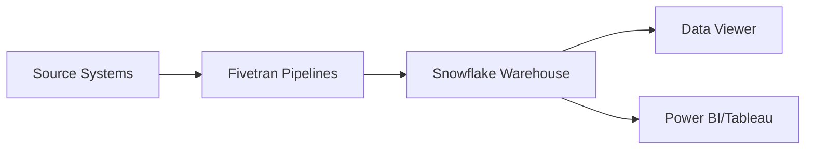

## Getting Started

### Accessing the Data Viewer

1. Log into your Kroo account at [app.kroo.com](https://app.kroo.com)
2. Navigate to **Data & Settings** in the main navigation
3. Click on the **Data Viewer** tab
4. The SQL editor will load with access to your configured data schemas

### Prerequisites

<CardGroup cols={3}>
<Card title="Authentication" icon="lock">
Must have Data Viewer permissions enabled by your Kroo administrator
</Card>

<Card title="Available Schemas" icon="database">
- `kroo_procore` - Procore project data
- `kroo_viewpoint_vista` - Viewpoint Vista ERP data
- Custom schemas configured for your organization
</Card>

<Card title="Data Freshness" icon="clock">
Data is synced according to your pipeline schedule (typically every 2-6 hours)
</Card>
</CardGroup>

<Warning>
**Critical Filter Requirement**

Always include `WHERE _fivetran_deleted = FALSE` or `WHERE _fivetran_deleted = 0` in your queries to exclude deleted records. Fivetran maintains this column to track soft-deleted data.
</Warning>

### Quick Start Example

Here's a real query to get started - finding active Procore projects:

```sql
SELECT
  id,
  name,
  project_number,
  active,
  created_at
FROM kroo_procore.projects
WHERE _fivetran_deleted = FALSE
  AND active = TRUE
ORDER BY created_at DESC
LIMIT 100
```

## Understanding Your Kroo Data Structure

### Schema Organization

Your Kroo warehouse contains synchronized data from multiple sources:

<CodeGroup>
```text Procore Schema
kroo_procore/                 # Procore construction data
├── projects                  # Project master data
├── rfis                      # RFIs (Requests for Information)
├── submittals                # Submittal logs
├── change_order_packages     # Change orders
└── [other Procore tables]
```

```text Vista Schema
kroo_viewpoint_vista/         # Vista ERP data
├── jcjm                      # Job Cost Job Master
├── jcci                      # Job Cost Committed Items
├── apvm                      # AP Vendor Master
├── pmop                      # Project Management Open Items
└── [other Vista tables]
```
</CodeGroup>

### Common Join Patterns

Joining Procore and Vista data:

```sql
SELECT
  p.name AS procore_project,
  p.project_number,
  v.Description AS vista_description,
  v.ContractAmt
FROM kroo_procore.projects p
JOIN kroo_viewpoint_vista.jcjm v
  ON p.project_number = v.Job
WHERE p._fivetran_deleted = FALSE
  AND v._fivetran_deleted = FALSE
```

## SQL Editor Features

### Real-Time Validation

The editor validates your SQL as you type with three severity levels:

<AccordionGroup>
<Accordion title="🔴 Errors (Red squiggly lines)" icon="circle-xmark">
Must be fixed before execution:
- Unclosed quotes: `WHERE name = 'Project` ← missing closing quote
- Unmatched parentheses: `WHERE id IN (1,2,3` ← missing )
- Invalid syntax: `WHERE id IN {1,2,3}` ← use () not {}
</Accordion>

<Accordion title="🟠 Warnings (Orange)" icon="triangle-exclamation">
May execute but should review
</Accordion>

<Accordion title="🔵 Info (Blue)" icon="circle-info">
Suggestions and non-critical hints:
- Possible typos: `SELCT` → `SELECT`
- Valid but noted: `SELECT 1` (no FROM clause is actually valid)
</Accordion>
</AccordionGroup>

<Tip>
Hover over any underlined text to see detailed error messages.
</Tip>

### Intelligent Auto-completion

Press `.` after a table alias to see available columns:

```sql
SELECT
  p.  -- Auto-completes Procore project columns
FROM kroo_procore.projects p
```

### Keyboard Shortcuts

| Shortcut | Action |
|----------|--------|
| **Ctrl/Cmd + Enter** | Execute query |
| **Ctrl + Shift + F** | Format SQL |
| **Ctrl + Space** | Trigger auto-completion |

## Executing Queries

### Query Limits and Performance

| Query Type | Recommended Limit | Timeout |
|------------|-------------------|---------|
| Data exploration | 100-1000 rows | 30 seconds |
| Export queries | 10,000 rows | 2 minutes |
| Aggregations | No limit needed | 2 minutes |

<Steps>
<Step title="Always use LIMIT when exploring">
Start with small result sets to understand the data
</Step>

<Step title="Filter with WHERE before ORDER BY">
Reduce the dataset before sorting for better performance
</Step>

<Step title="Check pipeline status for data freshness">
Verify recent syncs before running critical reports
</Step>

<Step title="Consider creating a view">
For complex, repeated queries, create a reusable view
</Step>
</Steps>

### Monitoring Data Freshness

Before running critical queries:

1. Go to **Data & Settings** → **Pipeline Status**
2. Check the last sync time for relevant connectors
3. Verify no sync errors are present

## Working with Results

### Data Grid Features

<CardGroup cols={2}>
<Card title="Sort" icon="arrow-up-arrow-down">
Click column headers
</Card>

<Card title="Resize" icon="arrows-left-right">
Drag column borders
</Card>

<Card title="Select" icon="square-check">
Click and drag to select multiple cells
</Card>

<Card title="Navigate" icon="arrows">
Use arrow keys or scroll
</Card>
</CardGroup>

### Export Options

- **Copy**: Select cells → Ctrl/Cmd + C
- **CSV Export**: Click "Export CSV" (up to 10,000 rows)
- **Excel Export**: Click "Export Excel" (formatting preserved)

## Common Business Queries

### Ready-to-Use Query Templates

<Tabs>
<Tab title="Active Projects with Recent RFIs">
```sql
SELECT
  p.name AS project_name,
  p.project_number,
  COUNT(r.id) AS rfi_count,
  MAX(r.created_at) AS latest_rfi_date
FROM kroo_procore.projects p
LEFT JOIN kroo_procore.rfis r
  ON p.id = r.project_id
  AND r._fivetran_deleted = FALSE
  AND r.created_at >= DATEADD(day, -30, CURRENT_DATE())
WHERE p.active = TRUE
  AND p._fivetran_deleted = FALSE
GROUP BY p.name, p.project_number
HAVING COUNT(r.id) > 0
ORDER BY rfi_count DESC
```
</Tab>

<Tab title="Change Orders by Month">
```sql
SELECT
  DATE_TRUNC('month', cop.created_at) AS month,
  COUNT(DISTINCT cop.id) AS change_order_count,
  SUM(cop.grand_total) AS total_amount,
  COUNT(DISTINCT cop.project_id) AS projects_affected
FROM kroo_procore.change_order_packages cop
WHERE cop._fivetran_deleted = FALSE
  AND cop.created_at >= DATEADD(month, -12, CURRENT_DATE())
GROUP BY DATE_TRUNC('month', cop.created_at)
ORDER BY month DESC
```
</Tab>

<Tab title="Vendor Payment Status">
```sql
-- Note: company_vendor_id may be NULL if vendor not mapped in Procore
SELECT
  v.VendorName,
  v.VendorNumber,
  COUNT(DISTINCT p.project_id) AS procore_projects,
  SUM(ap.Amount) AS total_vista_amount,
  MAX(ap.InvoiceDate) AS last_invoice_date
FROM kroo_viewpoint_vista.apvm v
LEFT JOIN kroo_viewpoint_vista.apvp ap
  ON v.Vendor = ap.Vendor
  AND ap._fivetran_deleted = FALSE
LEFT JOIN kroo_procore.vendors p
  ON v.VendorNumber = p.company_vendor_id
  AND p._fivetran_deleted = FALSE
WHERE v._fivetran_deleted = FALSE
GROUP BY v.VendorName, v.VendorNumber
HAVING SUM(ap.Amount) > 0
ORDER BY total_vista_amount DESC
LIMIT 100
```
</Tab>
</Tabs>

## Schema Quick Reference

### Key Tables and Columns

<Tabs>
<Tab title="kroo_procore.projects">
| Column | Type | Description | Notes |
|--------|------|-------------|-------|
| `id` | INTEGER | Unique Procore ID | Primary key |
| `project_number` | VARCHAR | Maps to Vista Job | Use for joins |
| `name` | VARCHAR | Project display name | |
| `active` | BOOLEAN | Project status | true/false |
| `created_at` | TIMESTAMP | Creation date | UTC timezone |
| `updated_at` | TIMESTAMP | Last modified | Updates on sync |
| `_fivetran_deleted` | BOOLEAN | Soft delete flag | **Always filter!** |
</Tab>

<Tab title="kroo_viewpoint_vista.jcjm">
| Column | Type | Description | Notes |
|--------|------|-------------|-------|
| `Job` | VARCHAR | Job number | Maps to Procore project_number |
| `Description` | VARCHAR | Job description | |
| `ContractAmt` | DECIMAL | Contract amount | |
| `JobStatus` | CHAR(1) | A=Active, C=Complete | |
| `StartMonth` | DATE | Job start date | |
| `_fivetran_deleted` | BOOLEAN | Soft delete flag | **Always filter!** |
</Tab>

<Tab title="kroo_procore.rfis">
| Column | Type | Description | Notes |
|--------|------|-------------|-------|
| `id` | INTEGER | RFI unique ID | |
| `project_id` | INTEGER | Links to projects.id | |
| `number` | VARCHAR | RFI number | |
| `subject` | VARCHAR | RFI title | |
| `status` | VARCHAR | Open/Closed/Draft | |
| `due_date` | DATE | Response due date | |
| `_fivetran_deleted` | BOOLEAN | Soft delete flag | **Always filter!** |
</Tab>
</Tabs>

## Data Type Considerations

### System Differences to Note

| Data Type | Procore | Viewpoint Vista | Conversion Tip |
|-----------|---------|-----------------|----------------|
| Booleans | true/false | 1/0 or 'Y'/'N' | Use CASE statements |
| Dates | ISO format | Various formats | Use DATE() function |
| Decimals | Standard | May have scale issues | ROUND() as needed |
| Status Codes | Full text | Single character | Join to lookup tables |

<CodeGroup>
```sql Boolean Conversion
SELECT
  CASE
    WHEN v.JobStatus = 'A' THEN true
    ELSE false
  END AS is_active
FROM kroo_viewpoint_vista.jcjm v
```
</CodeGroup>

## Pipeline Sync Schedules

### Typical Sync Frequencies

| Data Source | Sync Frequency | Latest Data Age | Notes |
|-------------|----------------|-----------------|-------|
| Procore | Every 2 hours | 2-3 hours | Runs 24/7 |
| Viewpoint Vista | Every 6 hours | 6-8 hours | 4 daily syncs |
| Custom Sources | Varies | Check pipeline status | Contact admin |

<Info>
**Tip**: For time-sensitive queries, check Pipeline Status before running reports to ensure latest sync completed successfully.

*Real-time triggers available for critical workflows - contact admin*
</Info>

## Creating and Managing Views

### When to Use Views vs. Data Viewer

<CardGroup cols={2}>
<Card title="Use Data Viewer When" icon="magnifying-glass">
- Exploring data ad-hoc
- Testing query logic
- One-time analysis
- Quick data checks
</Card>

<Card title="Create a View When" icon="layer-group">
- Query is used daily/weekly
- Multiple users need same data
- Feeding Power BI/Tableau
- Complex joins need optimization
</Card>
</CardGroup>

### Creating a View

<Steps>
<Step title="Write and test your query">
Use Data Viewer to perfect your SQL
</Step>

<Step title="Click Create View button">
Located in the toolbar above results
</Step>

<Step title="Enter view name">
Automatically converts to snake_case
</Step>

<Step title="Access your view">
Available in `kroo_views` schema
</Step>
</Steps>

Example:
```sql
-- Your query
SELECT * FROM kroo_procore.projects
WHERE active = TRUE
  AND _fivetran_deleted = FALSE

-- Becomes accessible as:
SELECT * FROM kroo_views.active_projects
```

### View Naming Conventions

Follow this pattern: `[department]_[description]_[frequency]`

**Examples:**
- `finance_active_projects_daily`
- `operations_rfi_summary_weekly`
- `accounting_vendor_reconciliation_monthly`

**Guidelines:**
- Use lowercase with underscores
- Include department prefix for organization
- Add frequency suffix if regularly refreshed
- Keep under 50 characters
- Avoid special characters

## Export Limits and Policies

### Technical vs Policy Limits

| Export Type | Row Limit | Reason | Override Process |
|-------------|-----------|--------|------------------|
| Display Grid | 1,000 | Performance | Use pagination |
| CSV Export | 10,000 | Browser memory | Create view → export from Snowflake |
| Excel Export | 10,000 | File size | Same as CSV |
| Copy to Clipboard | 5,000 | System clipboard | Export to file instead |

<Note>
**Need More Rows?**
1. Create a view with your query
2. Request Snowflake direct access from IT
3. Use Power BI/Tableau connection
4. Contact support@kroo.com for one-time exports
</Note>

## Integration with Kroo Ecosystem

### Data Flow



### Related Kroo Features

<CardGroup cols={2}>
<Card title="Pipeline Monitoring" icon="chart-line">
Check sync status before querying
</Card>

<Card title="SQL Views Management" icon="database">
Create persistent views for BI tools
</Card>

<Card title="Power BI Integration" icon="chart-pie">
Use views created here in Power BI reports
</Card>

<Card title="Two-Way Sync" icon="arrows-rotate">
Modifications flow back to source systems
</Card>
</CardGroup>

## Advanced Tips

### Query Performance Optimization

Use Materialized Views for Complex Joins:

```sql
-- Instead of repeatedly joining large tables
CREATE VIEW kroo_views.project_summary AS
SELECT /* complex query */

-- Consider asking admin for:
CREATE MATERIALIZED VIEW kroo_views.project_summary_mat AS
SELECT /* same complex query */
```

### Cross-System Data Validation

```sql
-- Verify data consistency between systems
SELECT
  'Procore' AS source,
  COUNT(DISTINCT project_number) AS project_count
FROM kroo_procore.projects
WHERE _fivetran_deleted = FALSE
UNION ALL
SELECT
  'Vista' AS source,
  COUNT(DISTINCT Job) AS project_count
FROM kroo_viewpoint_vista.jcjm
WHERE _fivetran_deleted = FALSE
```

## Troubleshooting

<AccordionGroup>
<Accordion title="No data returned but query is valid">
- Check `_fivetran_deleted = FALSE` filter
- Verify pipeline has completed recent sync
- Confirm you have access to the schema
</Accordion>

<Accordion title="Query timeout error">
- Add `LIMIT` clause
- Optimize joins (ensure join columns are indexed)
- Break complex query into smaller parts
- Consider creating a view for better performance
</Accordion>

<Accordion title="Schema not found error">
- Verify schema name spelling
- Check your permissions with administrator
- Ensure pipeline is configured for this data source
</Accordion>

<Accordion title="Stale or missing data">
1. Check Pipeline Status page
2. Look for sync errors
3. Verify source system connectivity
4. Contact support if syncs are failing
</Accordion>
</AccordionGroup>

### Performance Optimization for Kroo Warehouse

<CodeGroup>
```sql Inefficient
SELECT * FROM kroo_procore.rfis
ORDER BY created_at DESC
```

```sql Optimized
SELECT * FROM kroo_procore.rfis
WHERE _fivetran_deleted = FALSE
  AND created_at >= DATEADD(day, -30, CURRENT_DATE())
ORDER BY created_at DESC
LIMIT 1000
```
</CodeGroup>

## Best Practices

### Essential Query Patterns

<Tabs>
<Tab title="Always filter deleted records">
```sql
WHERE _fivetran_deleted = FALSE  -- Critical!
```
</Tab>

<Tab title="Use schema prefixes">
```sql
-- Good
FROM kroo_procore.projects

-- Avoid
FROM projects  -- Ambiguous
```
</Tab>

<Tab title="Date range filters">
```sql
WHERE created_at >= DATEADD(month, -3, CURRENT_DATE())
```
</Tab>
</Tabs>

### Security Considerations

<Warning>
- Query history is private to your account
- Row-level security applies based on your permissions
- Cannot modify data through Data Viewer (read-only)
- Exported data should be handled per your company's data policies
</Warning>

## Getting Help

### Resources

<CardGroup cols={3}>
<Card title="Video Tutorial" icon="video" href="https://help.kroo.com/data-viewer-intro">
Watch the intro video
</Card>

<Card title="Schema Documentation" icon="book">
Available in Schema Explorer sidebar
</Card>

<Card title="Support" icon="headset" href="mailto:support@kroo.com">
Email support or use in-app chat
</Card>
</CardGroup>

### Next Steps

<Steps>
<Step title="Try the quick start query">
Copy and run the example query above
</Step>

<Step title="Explore your schemas">
Use the Schema Explorer sidebar
</Step>

<Step title="Create your first saved query">
Save frequently used queries for quick access
</Step>

<Step title="Export data for analysis">
Download results as CSV or Excel
</Step>

<Step title="Consider creating views">
Turn repeated queries into reusable views
</Step>
</Steps>

---

<Note>
**Documentation Version**: 2.0 | **Last Updated**: January 30, 2025 | **Next Review**: Quarterly

For documentation updates or corrections, contact: support@kroo.com
</Note>